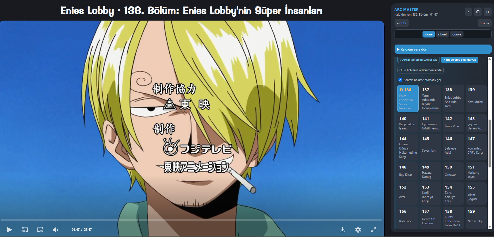

# OnePace Utilities

> A focused, multilingual viewing companion for OnePaceTR.

[English](#english) · [Türkçe](#türkçe) · [Español](#español)



---

## English

OnePace Utilities is a Chromium extension that improves the viewing experience on OnePaceTR. It turns the episode page into a focused player layout and adds an **Arc Master** panel for navigating arcs, tracking progress, resuming episodes, and managing playback preferences.

### Features

- Focused layout with a larger player and fewer distractions
- Arc and episode navigation from the Arc Master panel
- Automatic watch-progress tracking and resume support
- Completed, in-progress, and untouched episode states
- Mark a single episode or an entire arc as completed
- Reset the progress of the current episode
- Optional automatic playback of the next episode
- Configurable episode start time and playback speed
- Quick switching between available video sources
- Manga and anime source references when provided by OnePaceTR
- Interface languages: English, Turkish, and Spanish

### Installation

#### From a release

1. Download `onepace-utilities.zip` from the [latest release](https://github.com/unseensenpai/onepace-utilities/releases/latest).
2. Extract the ZIP file to a permanent folder.
3. Open your Chromium-based browser's extensions page:
   - Chrome: `chrome://extensions`
   - Edge: `edge://extensions`
   - Brave: `brave://extensions`
4. Enable **Developer mode**.
5. Select **Load unpacked** and choose the extracted folder containing `manifest.json`.
6. Open an episode on OnePaceTR. The extension activates automatically.

#### From source

```sh
git clone https://github.com/unseensenpai/onepace-utilities.git
cd onepace-utilities
```

Enable **Developer mode** on your browser's extensions page, select **Load unpacked**, and choose the repository folder.

### Usage

Open any episode page on OnePaceTR. Arc Master appears beside the player and highlights the active arc and episode. Use the gear button to change the language, resume behavior, episode start time, playback speed, and automatic next-episode setting.

Progress and preferences are stored through the browser extension storage APIs. The extension requires access to OnePaceTR and its supported embedded players to synchronize playback state and apply your preferences.

---

## Türkçe

OnePace Utilities, OnePaceTR üzerindeki izleme deneyimini geliştiren Chromium tabanlı bir tarayıcı eklentisidir. Bölüm sayfasını daha odaklı bir oynatıcı düzenine dönüştürür; arc ve bölüm gezintisi, ilerleme takibi, kaldığın yerden devam etme ve oynatıcı tercihleri için **Arc Master** panelini ekler.

### Özellikler

- Daha büyük oynatıcı ve daha az dikkat dağıtan odaklı görünüm
- Arc Master panelinden arc ve bölüm gezintisi
- Otomatik izleme ilerlemesi kaydı ve kaldığın yerden devam etme
- Tamamlanan, devam eden ve henüz başlanmayan bölüm durumları
- Tek bir bölümü veya bütün bir arc'ı tamamlandı olarak işaretleme
- Geçerli bölümün ilerlemesini sıfırlama
- İsteğe bağlı otomatik sonraki bölüm oynatma
- Ayarlanabilir bölüm başlangıç zamanı ve oynatma hızı
- Kullanılabilir video kaynakları arasında hızlı geçiş
- OnePaceTR tarafından sunulduğunda manga ve anime kaynak bilgileri
- Türkçe, İngilizce ve İspanyolca arayüz desteği

### Kurulum

#### Sürüm paketinden

1. [En son sürümden](https://github.com/unseensenpai/onepace-utilities/releases/latest) `onepace-utilities.zip` dosyasını indir.
2. ZIP dosyasını kalıcı bir klasöre çıkar.
3. Chromium tabanlı tarayıcının eklentiler sayfasını aç:
   - Chrome: `chrome://extensions`
   - Edge: `edge://extensions`
   - Brave: `brave://extensions`
4. **Geliştirici modu** seçeneğini etkinleştir.
5. **Paketlenmemiş öğe yükle** seçeneğine bas ve `manifest.json` dosyasını içeren klasörü seç.
6. OnePaceTR üzerinde bir bölüm aç. Eklenti otomatik olarak etkinleşir.

#### Kaynak koddan

```sh
git clone https://github.com/unseensenpai/onepace-utilities.git
cd onepace-utilities
```

Tarayıcının eklentiler sayfasında **Geliştirici modu** seçeneğini etkinleştir, **Paketlenmemiş öğe yükle** seçeneğine bas ve depo klasörünü seç.

### Kullanım

OnePaceTR üzerinde herhangi bir bölüm sayfasını aç. Arc Master oynatıcının yanında görünür; etkin arc ve bölümü vurgular. Dil, kaldığın yerden devam etme davranışı, bölüm başlangıç zamanı, oynatma hızı ve otomatik sonraki bölüm ayarlarını değiştirmek için dişli düğmesini kullan.

İzleme ilerlemesi ve tercihler tarayıcı eklentisinin depolama API'leri aracılığıyla saklanır. Eklenti, oynatma durumunu eşitlemek ve tercihlerini uygulamak için OnePaceTR ile desteklenen gömülü oynatıcılara erişim ister.

---

## Español

OnePace Utilities es una extensión para navegadores basados en Chromium que mejora la experiencia de reproducción en OnePaceTR. Convierte la página del episodio en una vista centrada en el reproductor y añade un panel **Maestro de Arcos** para navegar por arcos y episodios, registrar el progreso, reanudar la reproducción y gestionar las preferencias del reproductor.

### Funciones

- Vista enfocada con un reproductor más grande y menos distracciones
- Navegación por arcos y episodios desde el panel Maestro de Arcos
- Registro automático del progreso y reanudación de episodios
- Estados para episodios completados, en curso y no iniciados
- Opción para marcar un episodio o un arco completo como visto
- Restablecimiento del progreso del episodio actual
- Reproducción automática opcional del siguiente episodio
- Tiempo de inicio y velocidad de reproducción configurables
- Cambio rápido entre las fuentes de vídeo disponibles
- Referencias del manga y del anime cuando OnePaceTR las proporciona
- Interfaz disponible en español, inglés y turco

### Instalación

#### Desde una versión publicada

1. Descarga `onepace-utilities.zip` desde la [última versión](https://github.com/unseensenpai/onepace-utilities/releases/latest).
2. Extrae el archivo ZIP en una carpeta permanente.
3. Abre la página de extensiones de tu navegador basado en Chromium:
   - Chrome: `chrome://extensions`
   - Edge: `edge://extensions`
   - Brave: `brave://extensions`
4. Activa el **Modo de desarrollador**.
5. Selecciona **Cargar descomprimida** y elige la carpeta extraída que contiene `manifest.json`.
6. Abre un episodio en OnePaceTR. La extensión se activará automáticamente.

#### Desde el código fuente

```sh
git clone https://github.com/unseensenpai/onepace-utilities.git
cd onepace-utilities
```

Activa el **Modo de desarrollador** en la página de extensiones del navegador, selecciona **Cargar descomprimida** y elige la carpeta del repositorio.

### Uso

Abre cualquier página de episodio en OnePaceTR. El Maestro de Arcos aparecerá junto al reproductor y resaltará el arco y el episodio activos. Usa el botón del engranaje para cambiar el idioma, la reanudación, el tiempo de inicio, la velocidad de reproducción y el avance automático al siguiente episodio.

El progreso y las preferencias se guardan mediante las API de almacenamiento del navegador. La extensión necesita acceso a OnePaceTR y a sus reproductores integrados compatibles para sincronizar la reproducción y aplicar tus preferencias.

---

## Development

Requires [Node.js](https://nodejs.org/) 22 or later.

```sh
npm test
```

Pushing a Git tag in the `v*` format runs the test suite and creates a ZIP archive and GitHub Release automatically.

## Compatibility

OnePace Utilities targets Chromium-based browsers and currently integrates with OnePaceTR, AbyssPlayer, Sibnet, and Google Drive embeds.

## Disclaimer

This is an independent, community-made project. It is not affiliated with or endorsed by One Pace, OnePaceTR, Toei Animation, Shueisha, or any streaming provider. One Piece and related names and imagery belong to their respective owners.

## License

Released under the [MIT License](LICENSE).
